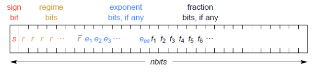
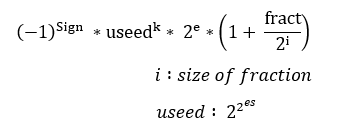
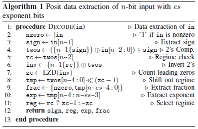

Implementation of VHDL modules for posit arithemetic 
====================================================

A new data type called a posit is designed as a direct drop-in replacement for IEEE Standard 754 floating-point numbers (floats). Unlike earlier forms of universal number (unum) arithmetic, posits do not require interval arithmetic or variable size operands; like floats, they round if an answer is inexact. However, they provide compelling advantages over floats, including larger dynamic range, higher accuracy, better closure, bitwise identical results across systems, simpler hardware, and simpler exception handling. The project would consist of implementing some of the basic modules (adders, multipliers) in VHDL or using any other Hardware Description Language. 

### 1. Posit design #

* 2 Parameters :    
  -   _**n**_ : size of posit    
  -   _**es**_ : size of exponent

* Bit fields :
    
    -   _**Sign bit**_ :  
      -  	if '0' ==> Positive number   
      -  	if '1' ==> Negative number
      
    -   _**Regime bits**_ :  
      -  	/r : '1'   -->   k = -m      m : nb of '0'   
      -  	/r : '0'   -->   k= m-1      m: nb of '1'
	   
    -   _**Exponent bits**_ :  
      -  	e  : value of exponent 
	    
    -   _**Fraction bits**_ :  
      -  	fract  : value of fraction
      
### 2. Value of Posit #

### 2. Implementation of VHDL modules  #

The modules VHDL "Posit extraction" & "Multiplier" are based on algotrithms presented in : 

_**"Deep Positron: A Deep Neural Network Using the Posit Number System"**_
_Zachariah Carmichael, Hamed F. Langroudi, Char Khazanov, Jeffrey Lillie,
John L. Gustafson, Dhireesha Kudithipudi
Neuromorphic AI Lab, Rochester Institute of Technology, NY, USA
National University of Singapore, Singapore_

Below you'll find algorithms used to implement modules.

#### 2.1. Posit extraction 

*

In our extraction module we added tow more output to check if the posit is __Zero__ ou __± infinity__.
Zero : "000...000"   
± infinity : "100...000"
#### 2.2. Multiplier  

#### 2.3. Pack Posit

				

  
